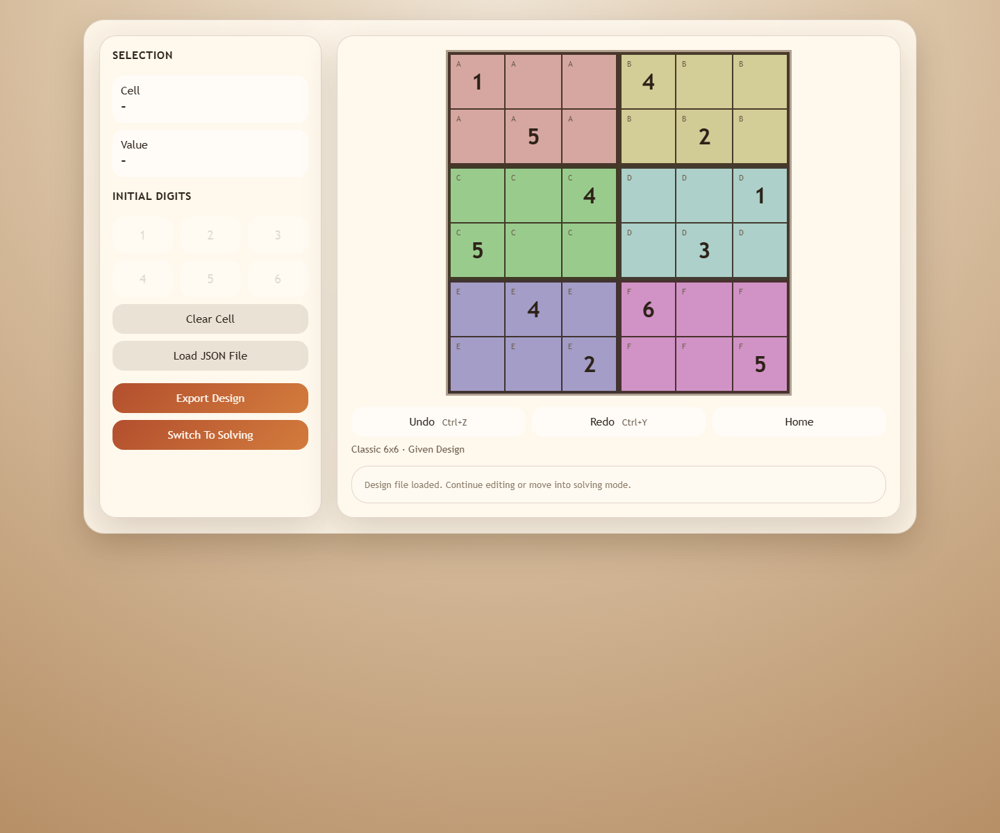
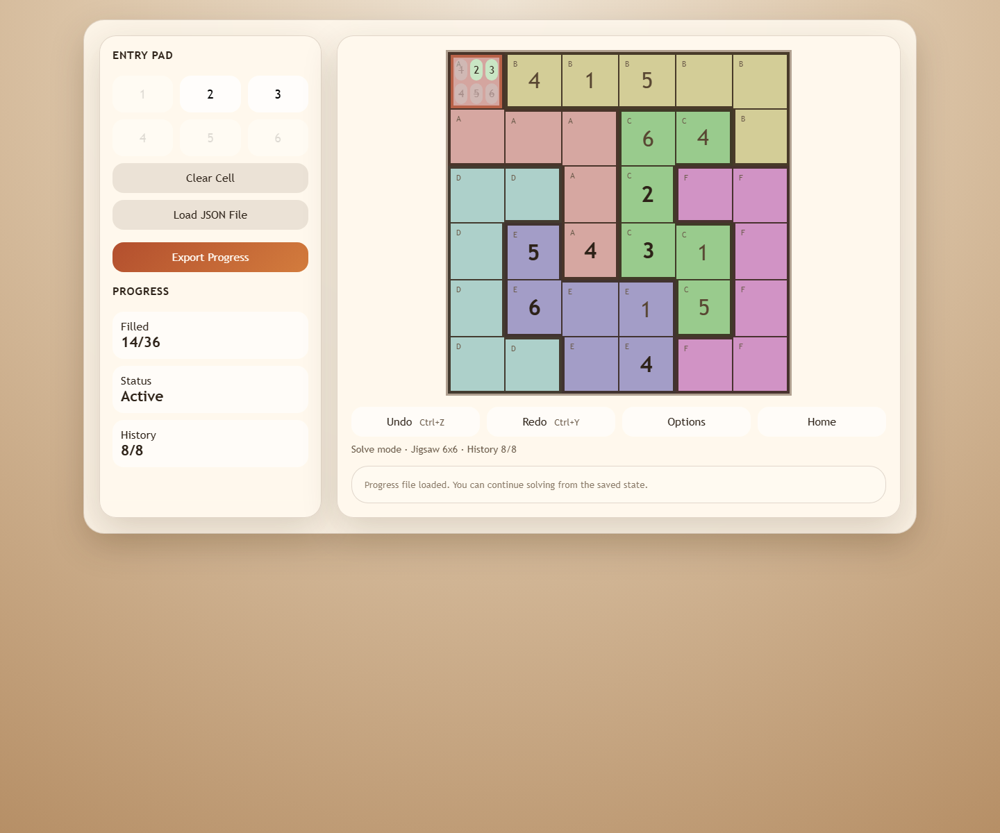

# Cat's Sudoku Studio

A browser-based Sudoku studio for building and solving classic and jigsaw boards from 3x3 through 9x9. *Live demo* available at `https://quadre.github.io/sudoku/`.

## Features

- Create classic Sudoku boards for supported sizes
- Design custom jigsaw region layouts
- Enter givens and switch into solving mode
- Import and export design and progress JSON files
- Track moves with undo and redo
- View candidate hints while solving


## Screenshots

Classic design view loaded from `samples/classic-6x6-design.json`:



Jigsaw solve view loaded from `samples/jigsaw-6x6-progress.json`:




## Run Locally

Serve the project root and open the app in a browser:

```bash
python serve.py
```

The app is then available at `http://127.0.0.1:8000/` by default.

## Sample Files

- `samples/classic-6x6-design.json`
- `samples/classic-6x6-progress.json`
- `samples/jigsaw-6x6-design.json`
- `samples/jigsaw-6x6-progress.json`

